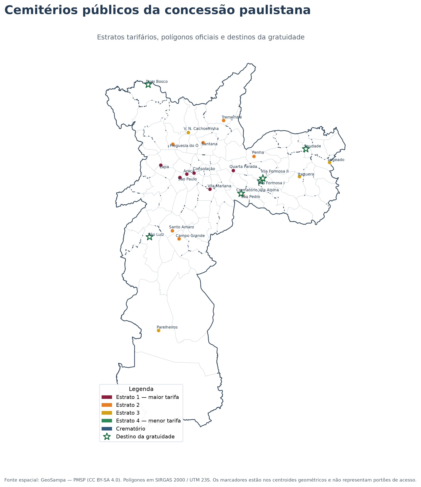

# Cemitérios de São Paulo — cidadania post mortem

Dados, mapas e rotinas reproduzíveis para analisar tarifas, gratuidade e desigualdade socioespacial nos cemitérios públicos concedidos do município de São Paulo.

## Primeiro resultado cartográfico

A base reúne **23 pontos operacionais**: 22 cemitérios considerados separadamente — incluindo Vila Formosa I e Vila Formosa II — e o Crematório Vila Alpina. A documentação da licitação agrupa Vila Formosa I e II em uma mesma unidade de memorial, razão pela qual diferentes documentos podem apresentar contagens distintas.

O mapa utiliza:

- polígonos oficiais da camada `geoportal:equipamento_cemiterio` do GeoSampa;
- limites dos 96 distritos municipais;
- classificação tarifária dos cemitérios em quatro estratos;
- indicação específica dos destinos da gratuidade por hipossuficiência;
- SIRGAS 2000 / UTM zona 23S (`EPSG:31983`) para cálculos espaciais;
- WGS 84 (`EPSG:4326`) para o mapa web.

Os marcadores estão posicionados nos **centroides geométricos** dos polígonos e não representam portões ou entradas. Os pontos de acesso público serão construídos como uma camada separada.

## Arquivos principais

### Inventários documentais

- [`data/reference/cemiterios_crematorio.csv`](data/reference/cemiterios_crematorio.csv) — endereços, blocos, concessionárias, estratos, gratuidade e tarifa avulsa de sepultamento;
- [`data/reference/agencias_funerarias.csv`](data/reference/agencias_funerarias.csv) — 40 agências funerárias;
- [`data/reference/geosampa_mapping.csv`](data/reference/geosampa_mapping.csv) — associação auditável entre os equipamentos da concessão e as feições do GeoSampa.

### Dados geográficos processados

- [`data/processed/cemiterios_concessao_31983.geojson`](data/processed/cemiterios_concessao_31983.geojson) — polígonos para análise métrica;
- [`data/processed/cemiterios_concessao_4326.geojson`](data/processed/cemiterios_concessao_4326.geojson) — polígonos para mapas web;
- [`data/processed/cemiterios_concessao_centroides.csv`](data/processed/cemiterios_concessao_centroides.csv) — área, perímetro e centroides;
- [`data/processed/distritos_4326.geojson`](data/processed/distritos_4326.geojson) — limites distritais;
- [`data/processed/subprefeituras_4326.geojson`](data/processed/subprefeituras_4326.geojson) — limites das subprefeituras.

### Mapas

- [`maps/mapa_estratos_gratuidade.png`](maps/mapa_estratos_gratuidade.png) — mapa estático;
- [`maps/mapa_estratos_gratuidade.svg`](maps/mapa_estratos_gratuidade.svg) — versão vetorial;
- [`maps/cemiterios_concessao_interativo.html`](maps/cemiterios_concessao_interativo.html) — mapa interativo com camadas e informações tarifárias.

## Cuidado interpretativo

A tarifa indicada no inventário é a tarifa **avulsa de sepultamento ou inumação por categoria**, na referência de janeiro de 2026. Ela não deve ser somada automaticamente a todos os pacotes funerários: a política tarifária possui regras próprias de composição, isenção e contratação.

A gratuidade também não é uma categoria tarifária. O campo correspondente identifica os destinos oficialmente disponibilizados para sepultamentos gratuitos por hipossuficiência; doadores de órgãos possuem regra específica que pode permitir sepultamento em qualquer cemitério público.

## Automação

O workflow do GitHub Actions:

1. consulta o WFS oficial do GeoSampa;
2. preserva a resposta bruta;
3. transforma as geometrias para uso web;
4. filtra os equipamentos da concessão;
5. dissolve feições múltiplas do mesmo equipamento;
6. calcula área, perímetro e centroides;
7. baixa distritos e subprefeituras;
8. recria os mapas estático e interativo.

## Próximas etapas

- localizar e validar os portões de acesso público;
- georreferenciar as 40 agências funerárias;
- associar cada equipamento a distrito e subprefeitura;
- medir distâncias e tempos de deslocamento;
- cruzar os estratos com renda, raça/cor e vulnerabilidade territorial;
- reconstruir o fluxo após o prazo dos sepultamentos temporários.

## Fontes principais

- Prefeitura de São Paulo — edital, contratos e anexos da concessão;
- SP Regula — endereços, concessionárias, agências, gratuidades e tarifas;
- GeoSampa — camadas geográficas municipais, sob licença CC BY-SA 4.0.

A metodologia completa está em [`docs/METODOLOGIA.md`](docs/METODOLOGIA.md).
